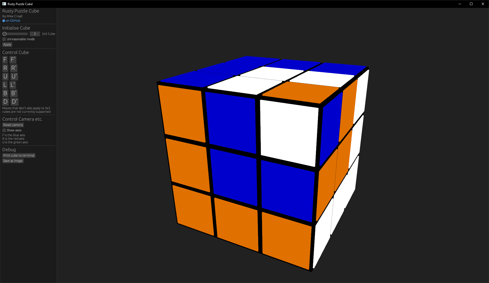
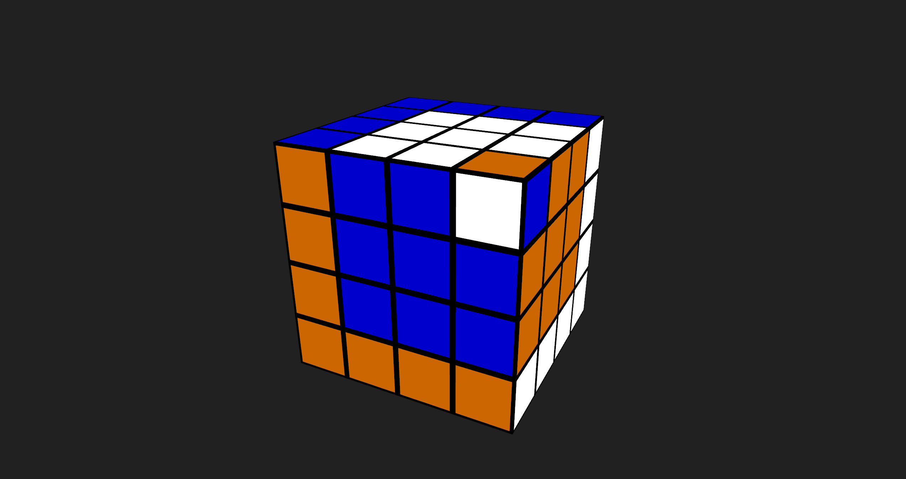
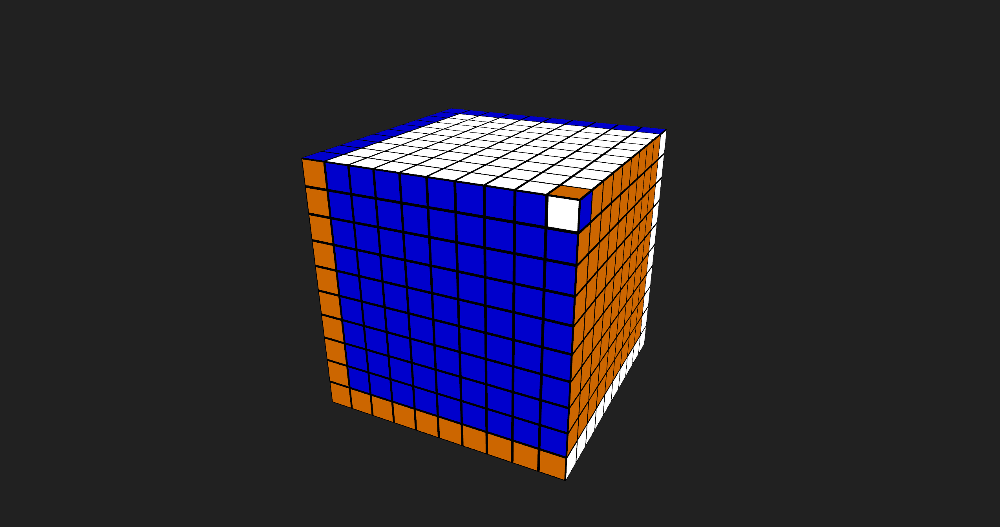

# Rusty Puzzle Cube

## An experimental implementation of simple puzzle cubes in Rust

<!-- [](https://codecov.io/gh/MikeCroall/rusty-puzzle-cube) -->
<!-- todo remove old coverage badge ^ and set new ones to main branch when merged v  -->

[](https://github.com/MikeCroall/rusty-puzzle-cube/actions) Core lib [](https://codecov.io/gh/MikeCroall/rusty-puzzle-cube) UI [](https://codecov.io/gh/MikeCroall/rusty-puzzle-cube)

### Puzzle Cube GUI

Experimental, still a work in progress, etc.

#### Cube in Cube in Cube (3x3 algo only on multiple cube sizes)





### Puzzle Cube Lib Demo

Demos of basic 3x3 notation being parsed and applied to a newly created cube

#### Cube in Cube in Cube

```rust
let mut cube = Cube::create(3);
let sequence = "F R' U' F' U L' B U' B2 U' F' R' B R2 F U L U";
perform_3x3_sequence(sequence, &mut cube).unwrap();
print!("{cube}");
```


#### Checkerboard Corners

```rust
let mut cube = Cube::create(3);
let sequence = "R2 L2 F2 B2 U2 D2";
perform_3x3_sequence(sequence, &mut cube).unwrap();
print!("{cube}");
```


#### Unique Cubies and Large Cubes

Large cubes can be created by providing a larger side length, and cubies can each be given a unique character to keep track of exactly where they move as moves are applied

Note that side length is limited to a maximum of 8 when using unique characters to avoid leaving the basic ASCII range (and trying to use the DEL control code in a cubie)

```rust
let mut cube = Cube::create_with_unique_characters(8);
print!("{cube}");
```


Note that large cubes do not currently support any moves that a 3x3 does not support.
For example, rotating only the center column of a 5x5, or the 2nd column of a 4x4 is currently impossible
