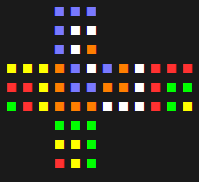

# Rusty Puzzle Cube

## An experimental implementation of simple puzzle cubes in rust

### Demo

Demos of basic 3x3 notation being parsed and applied to a newly created cube

#### Cube in Cube in Cube

```rust
let mut cube = Cube::create(3);
let sequence = "F R' U' F' U L' B U' B2 U' F' R' B R2 F U L U";
perform_3x3_sequence(sequence, &mut cube);
cube.print_cube();
```

Will print the below



#### Checkerboard Corners

```rust
let mut cube = Cube::create(3);
let sequence = "R2 L2 F2 B2 U2 D2";
perform_3x3_sequence(sequence, &mut cube);
cube.print_cube();
```

Will print the below


