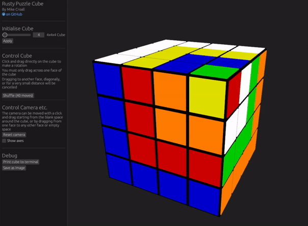
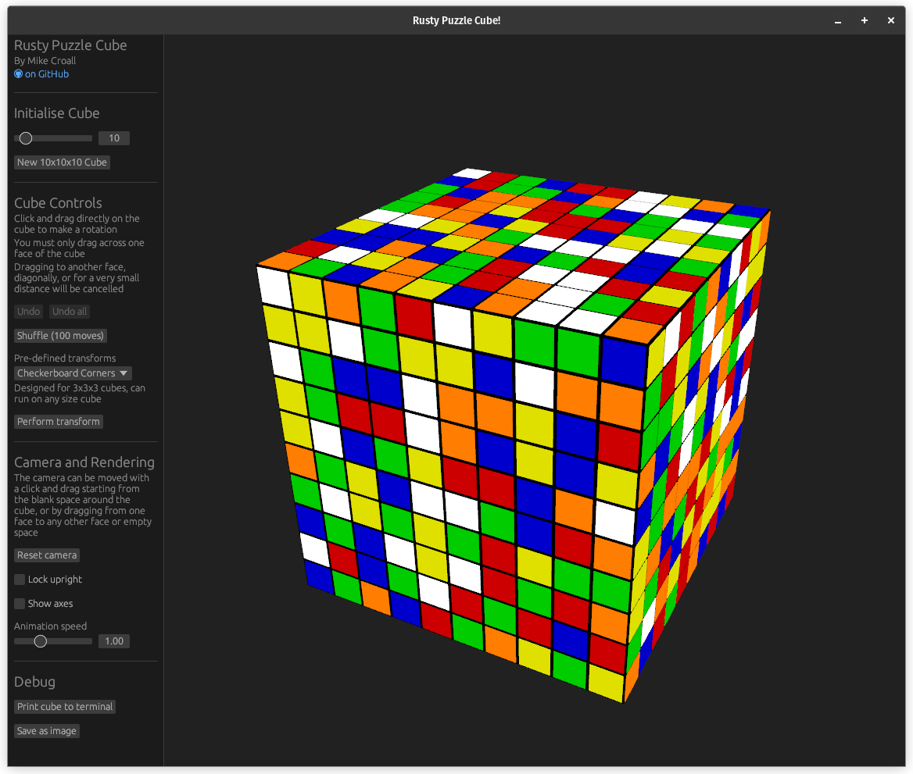

# Rusty Puzzle Cube

## An experimental implementation of simple puzzle cubes in Rust

[](https://github.com/MikeCroall/rusty-puzzle-cube/actions)
[](https://github.com/MikeCroall/rusty-puzzle-cube/actions)
[](https://github.com/MikeCroall/rusty-puzzle-cube/actions)
[](https://codecov.io/gh/MikeCroall/rusty-puzzle-cube?flags[0]=lib)
[](https://codecov.io/gh/MikeCroall/rusty-puzzle-cube?flags[0]=ui)
[![brainmade.org](https://img.shields.io/badge/brainmade.org-000000?style=flat&logo=data%3Aimage%2Fsvg%2Bxml%3Bbase64%2CPHN2ZyB4bWxucz0iaHR0cDovL3d3dy53My5vcmcvMjAwMC9zdmciIHdpZHRoPSIxZW0iIGhlaWdodD0iNzkiIHZpZXdCb3g9IjAgMCA2NyA3OSIgZmlsbD0ibm9uZSI%2BPHBhdGggZmlsbD0iI2ZmZiIgZD0iTTUyLjYxMiA3OC43ODJIMjMuMzNhMi41NTkgMi41NTkgMCAwIDEtMi41Ni0yLjU1OHYtNy42NzdoLTcuOTczYTIuNTYgMi41NiAwIDAgMS0yLjU2LTIuNTZWNTUuMzE1bC04LjgyLTQuMzk3YTIuNTU5IDIuNTU5IDAgMCAxLS45ODYtMy43MWw5LjgwNy0xNC43MTR2LTQuMzVDMTAuMjQgMTIuNTk5IDIyLjg0MyAwIDM4LjM4OCAwIDUzLjkzMiAwIDY2LjUzNCAxMi42IDY2LjUzOCAyOC4xNDNjLS42MzIgMjcuODI0LTEwLjc2IDIzLjUxNi0xMS4xOCAzNC4wNDVsLS4xODcgMTQuMDM1YTIuNTkgMi41OSAwIDAgMS0uNzUgMS44MSAyLjU1IDIuNTUgMCAwIDEtMS44MDkuNzVabS0yNi43MjMtNS4xMTdoMjQuMTY0bC4yODYtMTQuNTQyYy0uMjYzLTYuNjU2IDExLjcxNi04LjI0MyAxMS4wOC0zMC43MzQtLjM1OC0xMi43MTMtMTAuMzEzLTIzLjI3MS0yMy4wMzEtMjMuMjcxLTEyLjcxOCAwLTIzLjAyOSAxMC4zMDctMjMuMDMyIDIzLjAyNXY1LjExN2MwIC41MDYtLjE1IDEtLjQzIDEuNDJsLTguNjMgMTIuOTQxIDcuNjQ1IDMuODJhMi41NTkgMi41NTkgMCAwIDEgMS40MTUgMi4yOTF2OS42OTdoNy45NzRhMi41NTkgMi41NTkgMCAwIDEgMi41NiAyLjU1OXY3LjY3N1oiLz48cGF0aCBmaWxsPSIjZmZmIiBkPSJNNDAuMzcyIDU4LjIyMlYzOC45MzRjLjExOCAwIC4yMzcuMDE4LjM1NS4wMTggOS43NjktLjAxMiAxNy4wNS05LjAxMiAxNS4wMjItMTguNTY3YTIuMzY2IDIuMzY2IDAgMCAwLTEuODIxLTEuODIyYy04LjEwNi0xLjczLTE2LjEyMSAzLjI5Mi0xOC4wOTggMTEuMzQxLS4wMjQtLjAyNC0uMDQzLS4wNS0uMDY2LS4wNzNhMTUuMzIzIDE1LjMyMyAwIDAgMC0xNC4wNi00LjE3IDIuMzY1IDIuMzY1IDAgMCAwLTEuODIxIDEuODJjLTIuMDI4IDkuNTU1IDUuMjUyIDE4LjU1NCAxNS4wMiAxOC41NjguMjM2IDAgLjQ5Mi0uMDI4LjczOC0uMDR2MTIuMjEzaDQuNzMxWm0yLjgzOS0zMi4xNDNhMTAuNjQ2IDEwLjY0NiAwIDAgMSA4LjEyNC0zLjEwNmMuMzUgNi4zNC00Ljg4OCAxMS41NzctMTEuMjI4IDExLjIzYTEwLjU4IDEwLjU4IDAgMCAxIDMuMTA0LTguMTI0Wk0yNy40MDMgMzguMTkzYTEwLjYwNyAxMC42MDcgMCAwIDEtMy4xMTgtOC4xMjNjNi4zNDQtLjM1OCAxMS41ODcgNC44ODYgMTEuMjI4IDExLjIzLTMuMDIzLjE2OS01Ljk3My0uOTYxLTguMTEtMy4xMDdaIi8%2BPC9zdmc%2B)](https://brainmade.org/)

### Puzzle Cube GUI Crate

Still a work in progress. Screenshots and/or demo gif may not be fully up to date with the latest features.

<!--

Demo gif generated with below ffmpeg command

ffmpeg -ss 1 -t 35 -i demo-2026.mkv \                                           ✔  24s
-vf "fps=15,split[s0][s1];[s0]palettegen[p];[s1][p]paletteuse" \
-loop 0 demo-2026.gif

-->







#### Controls

Click and drag along a line of cubies to perform a rotation, making sure to remain on the face the drag started on

Shuffle will make `10n` random moves on an `n` x `n` x `n` cube

Some controls (debug) are removed on the WASM target

### Building Puzzle Cube GUI Crate for web

Build command written from inside the `web` dir

```bash
npx wasm-pack build "../puzzle-cube-ui" --target web --out-name web --out-dir ../web/pkg
```

Built files will be in `web/pkg/`, which can be hosted by

```bash
npm run serve
```

Then visit `http://localhost:8080`

### Puzzle Cube Lib Crate Demo

Demos of known transforms and basic notation being parsed and applied to a newly created cube

#### Notation Parsed: Cube in Cube in Cube

Also available as `KnownTransform::NestedCube3x3x3`

```rust
let mut cube = Cube::create(3.try_into()?);
let notation = "F R' U' F' U L' B U' B2 U' F' R' B R2 F U L U";
perform_notation(notation, &mut cube)?;
print!("{cube}");
```


#### Known Transform: Checkerboard Corners

```rust
let mut cube = Cube::create(3.try_into()?);
KnownTransform::CheckerboardCorners3x3x3.perform_instantly(&mut cube);
print!("{cube}");
```


#### Unique Cubies and Large Cubes

Large cubes can be created by providing a larger side length, and cubies can each be given a unique character to keep track of exactly where they move as moves are applied

Note that side length is limited to a maximum of 8 when using unique characters to avoid leaving the basic ASCII range (and trying to use the DEL control code in a cubie)

```rust
let mut cube = Cube::create_with_unique_characters(8.try_into()?);
print!("{cube}");
```


