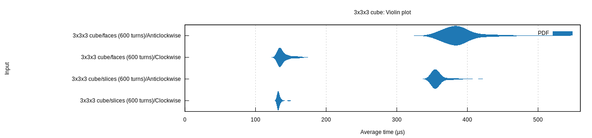
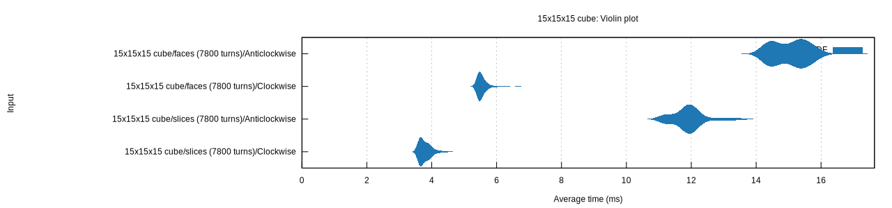

# Benches

Intended for comparisons between currently live code, such as how does a clockwise rotation compare to an anticlockwise rotation?
This example is a potentially useful one, as the anticlockwise rotation implementation is essentially 3 clockwise rotations but could be separately implemented for a performance boost.

Another example is how do slice rotations compare to face rotations, especially as the cube size grows?

## Cube Rotations

Run these benchmarks with

```shell
cargo bench --bench cube_rotations
```

then find the html report in the `target/criterion/report` directory

### Sample violin plots






